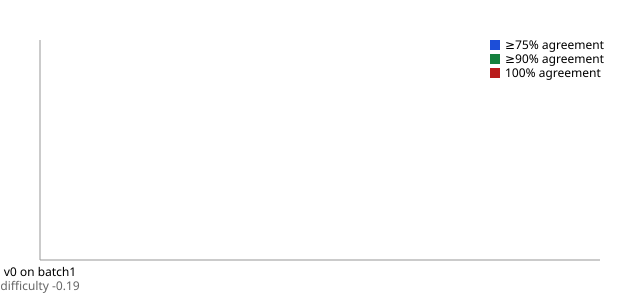

# CodeLoop reports

Regenerated 2026-09-17T14:20:22Z from committed data. In-scope fields: diagnoses, first-listed, and lines in the scope allowlist; E/M is excluded.

## Headline: live and holdout cells

| version | batch | tag | n | mean agreement | ≥75% | ≥90% | 100% | touches | minutes |
|---|---|---|---|---|---|---|---|---|---|
| — | holdout | not scored yet | | | | | | | |

## Appendix: version × batch (all cells, tagged)

| version | batch | tag | mean agreement | dx recall | line recall | scrubber acceptance | evidence support | query precision |
|---|---|---|---|---|---|---|---|---|

## Anchoring (blind subset)

| version | batch | n | blind vs reviewed | agent vs blind | agent vs reviewed |
|---|---|---|---|---|---|

## Scrubber rule-fire counts per cell

## Findings log

| id | status | batch | count | before | after | next-batch error rate |
|---|---|---|---|---|---|---|

## Other reports

- [Audit](audit.md)
- [Ingest](ingest.md)
- Holdout: not scored yet
- [calibration_dev_seed](calibration_dev_seed.md)
